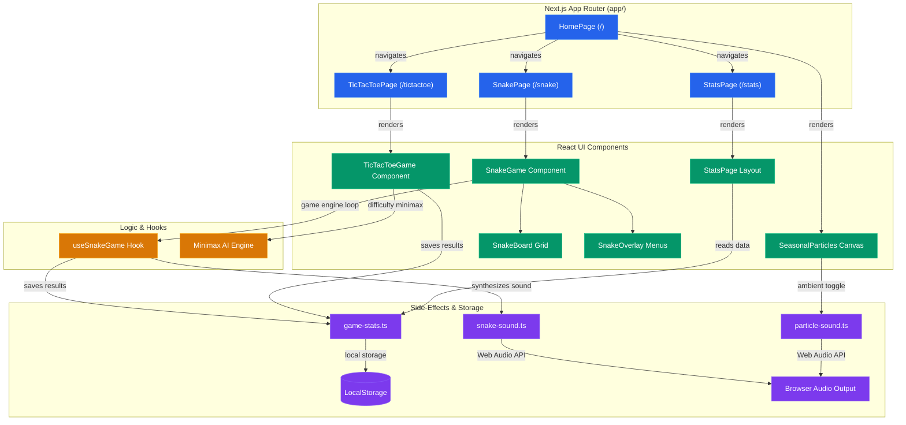

# 🕹️ RetroPulse Arcade — v1.0 🚀

[](https://opensource.org/licenses/MIT)
[](https://nodejs.org/)
[](https://nextjs.org/)
[](https://www.typescriptlang.org/)
[](#-testing--quality-assurance)
[](#-docker-setup)

Welcome to **RetroPulse**, a premium web-based retro arcade platform featuring beautifully reimagined classic games, advanced AI systems, deep game statistics, and dynamic seasonal ambiance. Built with **Next.js**, **React**, **Tailwind CSS**, and **TypeScript**. 🎨🎮

---

## 🎮 Included Games & Core Modules

### 1. 🐍 Retro Snake Game
A complete modern overhaul of the classic arcade favorite.
* **Dual Control Schemes**: Navigate using arrow keys or the standard `W`, `A`, `S`, `D` layout.
* **Game Modes**:
  * **Classic Mode**: Endless growth. Survive as long as possible by eating food and avoiding walls and self-collision.
  * **Timed Mode**: Score as many points as possible before the countdown timer expires.
* **Speed Scaling & Difficulties**: Play on **Easy**, **Normal**, or **Hard** where speed dynamically scales.
* **Curated Themes**: Dynamically switch the snake and board aesthetic (e.g. Neon, Retro, Cyberpunk, Dark Knight).
* **Audio & Audio Synthesis**: Synthetic sound effects for eating, crashing, and pausing/resuming.

### 2. ❌ Tic-Tac-Toe & Minimax AI
A sleek, modern iteration of Tic-Tac-Toe featuring local PvP and smart AI PvC modes.
* **Modes**:
  * **Local PvP**: Play on the same screen with a friend, switching turns dynamically.
  * **vs. Computer (AI)**: Face off against an intelligent bot.
* **Minimax AI Difficulty levels**:
  * **Easy**: Makes random moves 40% of the time, allowing casual players to win easily.
  * **Medium**: Employs shallow search depth (3 moves ahead), offering a decent, steady challenge.
  * **Hard (Unbeatable)**: Full Minimax path-solving algorithm (depth 9). Evaluates every future move to guarantee at least a draw or an AI win.

### 3. 📊 All-Time Statistics Dashboard (`/stats`)
A comprehensive stats engine that tracks performance across play sessions.
* **Streak Tracking**: Displays current consecutive play streak (days) and longest streak.
* **Snake Stats**: High score, average score per game, total food eaten, and maximum snake length achieved.
* **Tic-Tac-Toe Stats**: Wins as X, wins as O, draws, and win rate percentage.
* **Persistence**: LocalStorage-backed saving with full capability to reset stats.

### 4. 🍂 Dynamic Seasonal Particle System
The backdrop of the portal reacts dynamically to the time of year:
* ❄️ **Winter (Dec - Feb)**: Flurries of falling snowflakes.
* 🌸 **Spring (Mar - May)**: Floating light-pink cherry blossom petals.
* 💡 **Summer (Jun - Aug)**: Glowing, twinkling fireflies drifting upwards.
* 🍁 **Autumn (Sep - Nov)**: Rotating, multi-colored autumn leaves.
* Includes a toggle button in the header (with toggle sound effect) to enable/disable the ambient effects at any time.

---

## 🏗️ Architecture Design

The RetroPulse platform is structured to decouple routing, rendering, state loops, and storage concerns. Below are both text-based and visual/Mermaid representations of the architecture showing how user interactions flow through pages, components, engines, and side-effects.

### 🗺️ Text Schematic

```text
 ┌─────────────────────────────────────────────────────────────────┐
 │                   Next.js App Router (app/)                     │
 │                                                                 │
 │                         ┌──────────┐                            │
 │                         │ HomePage │                            │
 │                         └────┬─────┘                            │
 │         ┌────────────────────┼────────────────────┐             │
 │         ▼                    ▼                    ▼             │
 │   ┌───────────┐        ┌───────────┐        ┌───────────┐       │
 │   │ SnakePage │        │  TTTPage  │        │ StatsPage │       │
 │   └─────┬─────┘        └─────┬─────┘        └─────┬─────┘       │
 └─────────┼────────────────────┼────────────────────┼─────────────┘
           │                    │                    │
           ▼                    ▼                    ▼
 ┌──────────────────┐ ┌──────────────────┐ ┌──────────────────┐
 │  SnakeGame Comp  │ │  TicTacToe Comp  │ │ StatsPage Layout │
 │                  │ │                  │ │                  │
 │ ┌──────────────┐ │ │                  │ │                  │
 │ │  SnakeBoard  │ │ │                  │ │                  │
 │ └──────────────┘ │ │                  │ │                  │
 └─────────┬────────┘ └─────────┬────────┘ └─────────┬────────┘
           │                    │                    │
           ▼                    ▼                    ▼
 ┌──────────────────┐ ┌──────────────────┐ ┌──────────────────┐
 │ useSnakeGame.ts  │ │  Minimax Engine  │ │  game-stats.ts   │
 │ (Gameplay Loop)  │ │ (Unbeatable AI)  │ │ (Stats Tracker)  │
 └─────────┬────────┘ └─────────┬────────┘ └─────────┬────────┘
           │                    │                    │
           └────────────────────┼────────────────────┘
                                │
                                ▼
 ┌─────────────────────────────────────────────────────────────────┐
 │               Side-Effects, Storage & Ambiance                  │
 │                                                                 │
 │   ┌──────────────────────┐            ┌─────────────────────┐   │
 │   │   LocalStorage       │            │  Web Audio Engine   │   │
 │   │   (Stats & Streaks)  │            │  (Synthesized SFX)  │   │
 │   └──────────────────────┘            └─────────────────────┘   │
 └─────────────────────────────────────────────────────────────────┘
```

### 📊 Interaction Flow (Mermaid)



---

## 🛠️ Tech Stack

* **Framework**: [Next.js](https://nextjs.org/) (React 19, App Router, Turbopack)
* **Language**: [TypeScript](https://www.typescriptlang.org/) (Strict mode check)
* **Design & Styling**: [Tailwind CSS](https://tailwindcss.com/) & custom CSS keyframe animations
* **Icons**: [Lucide React](https://lucide.dev/)
* **Analytics**: [Vercel Analytics](https://vercel.com/analytics)
* **Testing Tooling**: [c8](https://github.com/bcoe/c8) for code coverage, [tsx](https://github.com/privatenumber/tsx) for TS runner execution

---

## 🚀 Getting Started

Ensure you have **Node.js (v18.0.0+)** installed on your system.

### 1. Clone the Codebase
```bash
git clone https://github.com/AmulThantharate/retropulse.git
cd retropulse
```

### 2. Install Project Dependencies
```bash
npm install
```

### 3. Start the Development Server
```bash
npm run dev
```
Open [http://localhost:3000](http://localhost:3000) to access the RetroPulse interface.

### 4. Build for Production
To create an optimized production bundle and run the server:
```bash
npm run build
npm run start
```

---

## 🐳 Docker Setup

You can build and run the application in a lightweight container environment using Docker. A multi-stage `Dockerfile` is provided for highly optimized production sizes.

### 1. Build the Docker Image
```bash
docker build -t retropulse:1.0 .
```

### 2. Run the Container
```bash
docker run -d -p 3000:3000 --name retropulse retropulse:1.0
```
Open [http://localhost:3000](http://localhost:3000) in your browser.

---

## 🧪 Testing & Quality Assurance

The codebase includes an extensive smoke test suite validating core game state transitions, Minimax AI moves, win conditions, and Snake movement/collision physics.

### Run Unit/Smoke Tests
```bash
npm test
```

### Run Coverage Reports
Generate detailed terminal and HTML coverage statistics using `c8`:
```bash
npm run test:coverage
```

---

## 📂 Project Structure

```text
├── app/                  # Next.js App Router Pages
│   ├── page.tsx          # Main RetroPulse Landing Portal
│   ├── layout.tsx        # Global provider layouts (Themes, Fonts, Analytics)
│   ├── globals.css       # Custom styles, gradients, dot patterns, animations
│   ├── snake/            # Snake game screen page
│   ├── tictactoe/        # Tic-Tac-Toe game screen page
│   └── stats/            # Game statistics page
├── components/           # React Components
│   ├── ui/               # Reusable primitives (Buttons, Cards, Badges)
│   ├── snake-game.tsx    # Snake gameplay component
│   ├── snake-board.tsx   # Canvas-free modular grid rendering
│   ├── snake-overlay.tsx # Overlays for Start/Pause/Game Over menus
│   ├── snake-settings.tsx# Difficulty and Theme selectors
│   ├── tictactoe-game.tsx# Tic-Tac-Toe grid and game mode controls
│   └── seasonal-particles.tsx # Canvas background particle engines
├── hooks/                # Custom React hooks (useSnakeGame, etc.)
├── lib/                  # Shared utilities
│   ├── game-stats.ts     # LocalStorage state sync for statistics
│   ├── snake-constants.ts# Math grids, movement vectors, directional constants
│   ├── snake-sound.ts    # Web Audio synthesis API for sound effects
│   └── particle-sound.ts # Sound toggle generators
├── scripts/              # Verification & automated test runners
│   └── smoke-test.ts     # Game mechanics validation script
├── Dockerfile            # Multi-stage Docker packaging configuration
├── .dockerignore         # Docker context exclusions
└── LICENSE               # MIT License details
```

---

## 👥 Author

* **Amul Thantharate**
  * GitHub: [@AmulThantharate](https://github.com/AmulThantharate)
  * Email: [amulthantharate69@gmail.com](mailto:amulthantharate69@gmail.com)

---

## 📄 License

Distributed under the MIT License. See [LICENSE](LICENSE) for more information.

